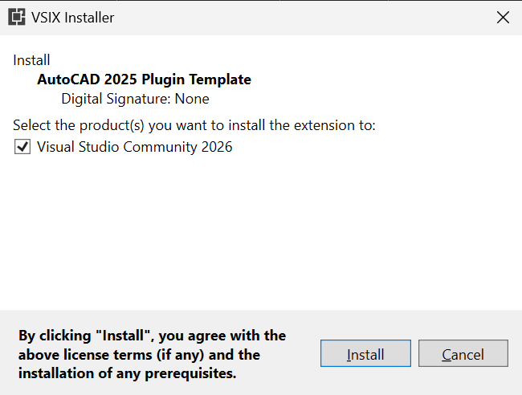
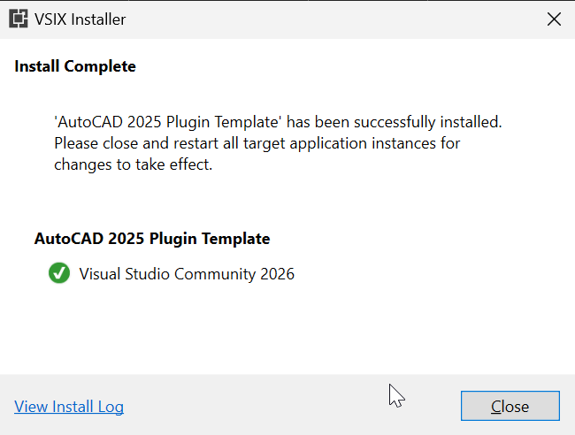
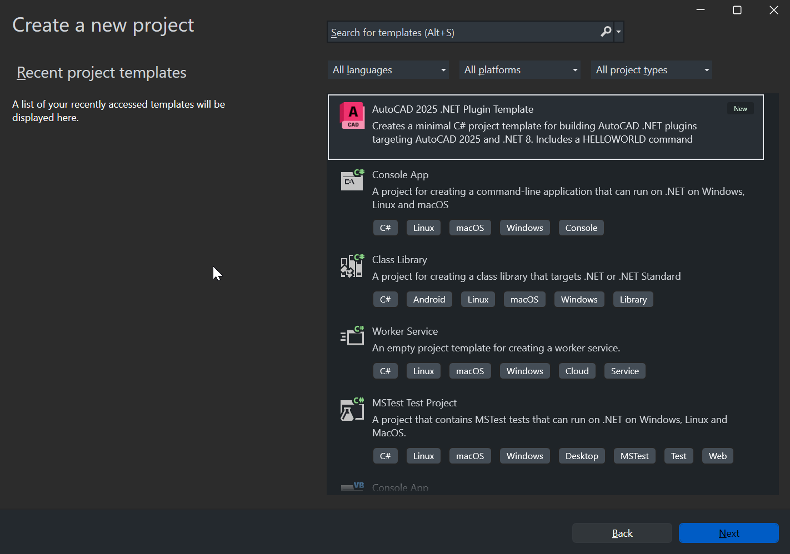
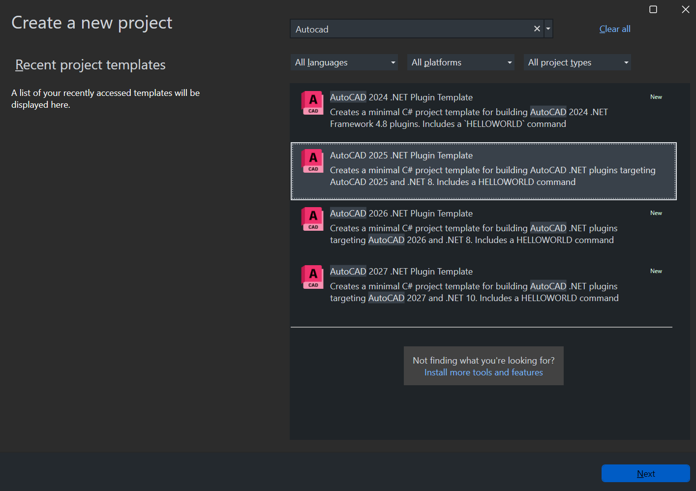
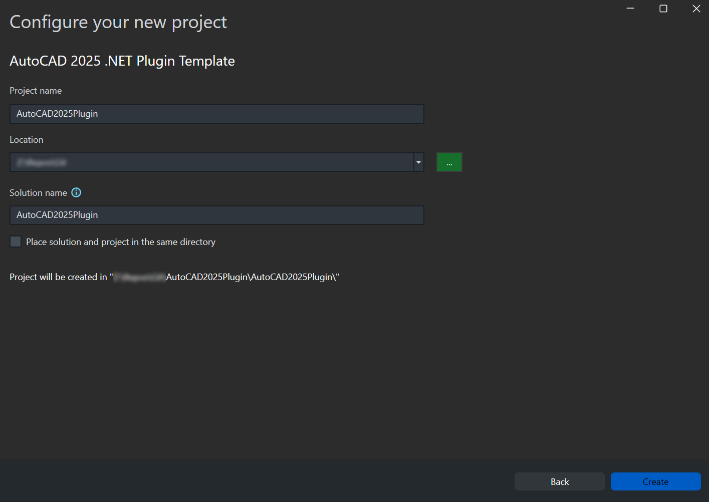

# AutoCAD .NET Plugin Templates

This repository was inspired by the [AutoCAD-Csharp-Project-Template](https://github.com/gileCAD/AutoCAD-Csharp-Project-Template) repository by [gileCAD](https://github.com/gileCAD).

This repository publishes installable Visual Studio extensions that provide AutoCAD .NET plugin project templates for Visual Studio.

Currently, there are extensions for the following versions of AutoCAD:

* AutoCAD 2024
* AutoCAD 2025
* AutoCAD 2026
* AutoCAD 2027

The `starter-projects/` folder contains example projects generated from the extensions.

## Installation

Download the latest [.vsix](https://github.com/kevinscottuk/autocad-dotnet-plugin-templates/releases) file for the required AutoCAD version. Multiple versions can be installed in Visual Studio side by side.

* Close Visual Studio if it is running.
* Run the downloaded `.vsix` installer and select the Visual Studio product that the extension should be installed to.
  


* When the installation is complete, restart the target application when prompted.



* After installation, the template will be available when creating a new project in Visual Studio.



## Creating a new AutoCAD plugin project

* Open Visual Studio.
* Select Create a new project.
* Search for the installed AutoCAD plugin template.



* Choose the template and create the project.



* Restore NuGet packages if prompted.
* Build the solution.

The generated project is intended to give the user a working starting point rather than a finished plugin.

## Run and Debug

The projects are configured to launch the targeted AutoCAD version directly from Visual Studio.

The default installation path for the matching AutoCAD 20XX executable is assumed. If AutoCAD is installed in a non-default location, update `Properties/launchSettings.json` in the project for AutoCAD 2025 and newer.

```json
{
  "profiles": {
    "AutoCAD2025Plugin": {
      "commandName": "Executable",
      "executablePath": "C:\\Program Files\\Autodesk\\AutoCAD 2025\\acad.exe",
      "commandLineArgs": "/nologo /b \"netload.scr\""
    }
  }
}
```

For AutoCAD 2024 projects, update the `Start external program` path in the `Project Properties`.


Once AutoCAD has started, the included `netload.scr` script is executed. This script loads the plugin DLL automatically, so the user does not need to type the `NETLOAD` command manually.

To allow automatic loading of the assembly, the `LEGACYCODESEARCH` system variable must be set to `1`. For more information on `LEGACYCODESEARCH`, see the Autodesk reference [LEGACYCODESEARCH (System Variable)](https://help.autodesk.com/view/ACD/2027/ENU/?guid=GUID-1E582989-79A5-4B88-A9C2-8826E3FF9430).

When the plugin has loaded a confirmation message appears in the AutoCAD command line.

The project templates include a starter `HELLOWORLD` command. When the command runs, a confirmation message is shown in the AutoCAD command line.

## Uninstall Extension

To uninstall the extensions, open the `Extension Manager` by using the `Extensions > Manage Extensions` menu.


Select the extension to be uninstalled and click `Uninstall`. Close Visual Studio. The extension will be uninstalled.
